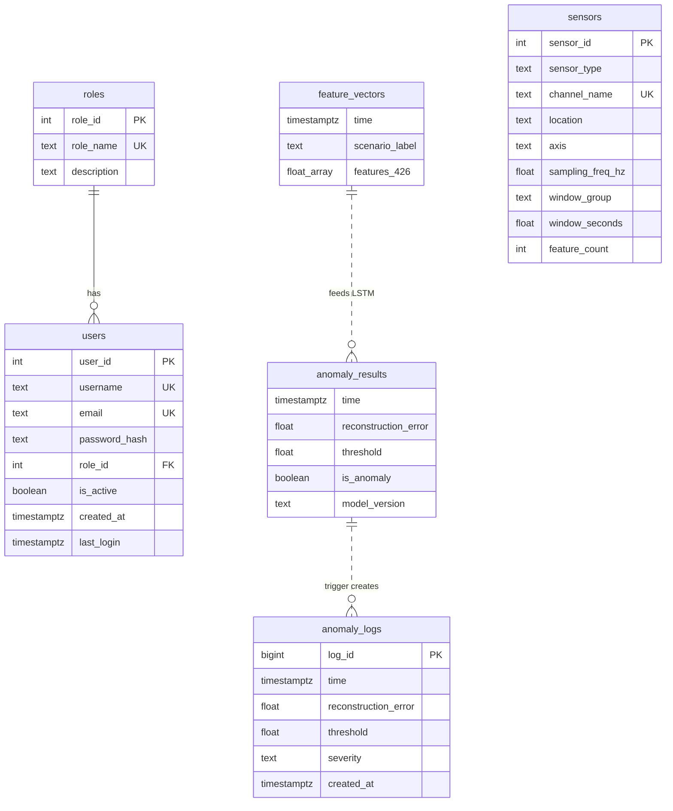

# Wind Turbine Predictive Maintenance — Database & Proje Planı (v3)

## 1. Veritabanı Tasarımı (Rapor §C.5 Bazlı)

### 1.1 ER Diyagramı



### 1.2 Tablo Tanımları

---

#### `roles`

```sql
CREATE TABLE IF NOT EXISTS roles (
    role_id     SERIAL PRIMARY KEY,
    role_name   TEXT NOT NULL UNIQUE,
    description TEXT,
    created_at  TIMESTAMPTZ DEFAULT CURRENT_TIMESTAMP
);

INSERT INTO roles (role_name, description) VALUES
    ('admin',    'Sistem yöneticisi'),
    ('operator', 'Operatör'),
    ('viewer',   'Görüntüleyici')
ON CONFLICT (role_name) DO NOTHING;
```

---

#### `users`

```sql
CREATE TABLE IF NOT EXISTS users (
    user_id       SERIAL PRIMARY KEY,
    username      TEXT NOT NULL UNIQUE,
    email         TEXT NOT NULL UNIQUE,
    password_hash TEXT NOT NULL,
    role_id       INTEGER NOT NULL REFERENCES roles(role_id) ON DELETE RESTRICT,
    is_active     BOOLEAN DEFAULT TRUE,
    created_at    TIMESTAMPTZ DEFAULT CURRENT_TIMESTAMP,
    last_login    TIMESTAMPTZ
);

CREATE INDEX IF NOT EXISTS idx_users_email ON users(email);
```

---

#### `sensors` — 28 Kanal Metadata (Rapor §C.5.2)

```sql
CREATE TABLE IF NOT EXISTS sensors (
    sensor_id        SERIAL PRIMARY KEY,
    sensor_type      TEXT NOT NULL CHECK (sensor_type IN (
                         'accelerometer', 'temperature', 'tachometer',
                         'anemometer', 'wind_vane')),
    channel_name     TEXT NOT NULL UNIQUE,
    location         TEXT,
    axis             TEXT,
    sampling_freq_hz DOUBLE PRECISION NOT NULL CHECK (sampling_freq_hz > 0),
    window_group     TEXT NOT NULL CHECK (window_group IN (
                         'bearing', 'nacelle', 'tower', 'slow')),
    window_seconds   DOUBLE PRECISION NOT NULL CHECK (window_seconds IN (1.0, 5.0)),
    feature_count    INTEGER NOT NULL CHECK (feature_count IN (15, 16))
);

-- 28 kanal seed (Bearing 6ch, Nacelle 3ch, Tower/Tach 13ch, Slow 6ch)
INSERT INTO sensors (sensor_type, channel_name, location, axis, sampling_freq_hz, window_group, window_seconds, feature_count) VALUES
    ('accelerometer', 'brng_f_x', 'front_bearing', 'x', 74000, 'bearing', 1.0, 16),
    ('accelerometer', 'brng_f_y', 'front_bearing', 'y', 74000, 'bearing', 1.0, 16),
    ('accelerometer', 'brng_f_z', 'front_bearing', 'z', 74000, 'bearing', 1.0, 16),
    ('accelerometer', 'brng_r_x', 'rear_bearing',  'x', 74000, 'bearing', 1.0, 16),
    ('accelerometer', 'brng_r_y', 'rear_bearing',  'y', 74000, 'bearing', 1.0, 16),
    ('accelerometer', 'brng_r_z', 'rear_bearing',  'z', 74000, 'bearing', 1.0, 16),
    ('accelerometer', 'Nacl_x',   'nacelle', 'x', 37000, 'nacelle', 1.0, 15),
    ('accelerometer', 'Nacl_y',   'nacelle', 'y', 37000, 'nacelle', 1.0, 15),
    ('accelerometer', 'Nacl_z',   'nacelle', 'z', 37000, 'nacelle', 1.0, 15),
    ('tachometer',    'tach',     'rotor',        NULL, 2960, 'tower', 5.0, 15),
    ('accelerometer', 'bot_f_x',  'tower_bottom', 'x',  2960, 'tower', 5.0, 15),
    ('accelerometer', 'bot_f_y',  'tower_bottom', 'y',  2960, 'tower', 5.0, 15),
    ('accelerometer', 'bot_f_z',  'tower_bottom', 'z',  2960, 'tower', 5.0, 15),
    ('accelerometer', 'bot_r_x',  'tower_bottom', 'x',  2960, 'tower', 5.0, 15),
    ('accelerometer', 'bot_r_y',  'tower_bottom', 'y',  2960, 'tower', 5.0, 15),
    ('accelerometer', 'bot_r_z',  'tower_bottom', 'z',  2960, 'tower', 5.0, 15),
    ('accelerometer', 'top_l_x',  'tower_top',    'x',  2960, 'tower', 5.0, 15),
    ('accelerometer', 'top_l_y',  'tower_top',    'y',  2960, 'tower', 5.0, 15),
    ('accelerometer', 'top_l_z',  'tower_top',    'z',  2960, 'tower', 5.0, 15),
    ('accelerometer', 'top_r_x',  'tower_top',    'x',  2960, 'tower', 5.0, 15),
    ('accelerometer', 'top_r_y',  'tower_top',    'y',  2960, 'tower', 5.0, 15),
    ('accelerometer', 'top_r_z',  'tower_top',    'z',  2960, 'tower', 5.0, 15),
    ('temperature',   'tmp_amb',    'nacelle_ambient', NULL, 1480, 'slow', 5.0, 15),
    ('temperature',   'tmp_brng_f', 'front_bearing',   NULL, 1480, 'slow', 5.0, 15),
    ('temperature',   'tmp_brng_r', 'rear_bearing',    NULL, 1480, 'slow', 5.0, 15),
    ('anemometer',    'anm_mst',    'mast_9m',         NULL, 1480, 'slow', 5.0, 15),
    ('anemometer',    'anm_roof',   'roof_12.5m',      NULL, 1480, 'slow', 5.0, 15),
    ('wind_vane',     'van',        'nacelle_top',     NULL, 1480, 'slow', 5.0, 15)
ON CONFLICT (channel_name) DO NOTHING;
```

---

#### `feature_vectors` — HYPERTABLE (Rapor §C.5.1.3)

```sql
CREATE TABLE IF NOT EXISTS feature_vectors (
    time            TIMESTAMPTZ         NOT NULL,
    scenario_label  TEXT                DEFAULT 'unknown',
    features        DOUBLE PRECISION[]  NOT NULL
);

SELECT create_hypertable('feature_vectors', 'time', if_not_exists => TRUE);

CREATE INDEX IF NOT EXISTS idx_fv_time ON feature_vectors (time DESC);
CREATE INDEX IF NOT EXISTS idx_fv_scenario ON feature_vectors (scenario_label, time DESC);
```

---

#### `anomaly_results` — HYPERTABLE (Rapor §C.5.1.1)

```sql
CREATE TABLE IF NOT EXISTS anomaly_results (
    time                 TIMESTAMPTZ      NOT NULL,
    reconstruction_error DOUBLE PRECISION NOT NULL CHECK (reconstruction_error >= 0),
    threshold            DOUBLE PRECISION NOT NULL CHECK (threshold > 0),
    is_anomaly           BOOLEAN          NOT NULL,
    model_version        TEXT             DEFAULT 'v1'
);

SELECT create_hypertable('anomaly_results', 'time', if_not_exists => TRUE);

CREATE INDEX IF NOT EXISTS idx_ar_time ON anomaly_results (time DESC);
CREATE INDEX IF NOT EXISTS idx_ar_anomaly ON anomaly_results (is_anomaly, time DESC);
```

---

#### `anomaly_logs` — İLİŞKİSEL (Rapor §C.5.3.2)

```sql
CREATE TABLE IF NOT EXISTS anomaly_logs (
    log_id               BIGSERIAL PRIMARY KEY,
    time                 TIMESTAMPTZ      NOT NULL,
    reconstruction_error DOUBLE PRECISION NOT NULL,
    threshold            DOUBLE PRECISION NOT NULL,
    severity             TEXT NOT NULL CHECK (severity IN ('LOW', 'MEDIUM', 'HIGH')),
    created_at           TIMESTAMPTZ      DEFAULT CURRENT_TIMESTAMP
);

CREATE INDEX IF NOT EXISTS idx_al_severity ON anomaly_logs(severity, time DESC);
```

---

#### Trigger: anomaly_results → anomaly_logs (Rapor Tablo 26, T-1)

```sql
CREATE OR REPLACE FUNCTION fn_auto_log_anomaly()
RETURNS TRIGGER AS $$
DECLARE
    sev   TEXT;
    ratio DOUBLE PRECISION;
BEGIN
    IF NEW.is_anomaly = TRUE THEN
        ratio := NEW.reconstruction_error / NULLIF(NEW.threshold, 0);
        IF ratio >= 2.0 THEN sev := 'HIGH';
        ELSIF ratio >= 1.5 THEN sev := 'MEDIUM';
        ELSE sev := 'LOW';
        END IF;

        INSERT INTO anomaly_logs (time, reconstruction_error, threshold, severity)
        VALUES (NEW.time, NEW.reconstruction_error, NEW.threshold, sev);
    END IF;
    RETURN NEW;
END;
$$ LANGUAGE plpgsql;

DROP TRIGGER IF EXISTS trg_auto_log_anomaly ON anomaly_results;
CREATE TRIGGER trg_auto_log_anomaly
    AFTER INSERT ON anomaly_results
    FOR EACH ROW EXECUTE FUNCTION fn_auto_log_anomaly();
```

---

#### Stored Procedures (Rapor Tablo 26)

```sql
-- SP-1: LSTM girdisi — son N feature vector
CREATE OR REPLACE FUNCTION sp_get_latest_features(p_limit INTEGER DEFAULT 20)
RETURNS TABLE (time TIMESTAMPTZ, features DOUBLE PRECISION[]) AS $$
BEGIN
    RETURN QUERY
    SELECT fv.time, fv.features FROM feature_vectors fv
    ORDER BY fv.time DESC LIMIT p_limit;
END; $$ LANGUAGE plpgsql;

-- SP-2: Zaman aralığı + senaryo filtresi
CREATE OR REPLACE FUNCTION sp_get_features_by_range(
    p_start TIMESTAMPTZ, p_end TIMESTAMPTZ, p_scenario TEXT DEFAULT NULL
) RETURNS TABLE (time TIMESTAMPTZ, scenario_label TEXT, features DOUBLE PRECISION[]) AS $$
BEGIN
    RETURN QUERY
    SELECT fv.time, fv.scenario_label, fv.features FROM feature_vectors fv
    WHERE fv.time BETWEEN p_start AND p_end
      AND (p_scenario IS NULL OR fv.scenario_label = p_scenario)
    ORDER BY fv.time ASC;
END; $$ LANGUAGE plpgsql;

-- SP-3: Anomaly özet istatistikleri
CREATE OR REPLACE FUNCTION sp_anomaly_summary(
    p_start TIMESTAMPTZ DEFAULT NOW() - INTERVAL '24 hours',
    p_end   TIMESTAMPTZ DEFAULT NOW()
) RETURNS TABLE (severity TEXT, total_count BIGINT, avg_score DOUBLE PRECISION, max_score DOUBLE PRECISION) AS $$
BEGIN
    RETURN QUERY
    SELECT al.severity, COUNT(*)::BIGINT, AVG(al.reconstruction_error), MAX(al.reconstruction_error)
    FROM anomaly_logs al WHERE al.time BETWEEN p_start AND p_end
    GROUP BY al.severity ORDER BY al.severity;
END; $$ LANGUAGE plpgsql;

-- SP-4: Model performans
CREATE OR REPLACE FUNCTION sp_model_stats(
    p_start TIMESTAMPTZ DEFAULT NOW() - INTERVAL '24 hours',
    p_end   TIMESTAMPTZ DEFAULT NOW()
) RETURNS TABLE (total_inferences BIGINT, anomaly_count BIGINT, normal_count BIGINT,
                 avg_error DOUBLE PRECISION, max_error DOUBLE PRECISION, anomaly_rate DOUBLE PRECISION) AS $$
BEGIN
    RETURN QUERY
    SELECT COUNT(*)::BIGINT,
           COUNT(*) FILTER (WHERE ar.is_anomaly)::BIGINT,
           COUNT(*) FILTER (WHERE NOT ar.is_anomaly)::BIGINT,
           AVG(ar.reconstruction_error), MAX(ar.reconstruction_error),
           CASE WHEN COUNT(*) > 0
                THEN COUNT(*) FILTER (WHERE ar.is_anomaly)::DOUBLE PRECISION / COUNT(*)
                ELSE 0.0 END
    FROM anomaly_results ar WHERE ar.time BETWEEN p_start AND p_end;
END; $$ LANGUAGE plpgsql;
```

---

### 1.3 Tablo Özeti

| Tablo | Tür | Hypertable? | Satır | Açıklama |
|---|---|---|---|---|
| `roles` | İlişkisel | ❌ | 3 | Sabit roller |
| `users` | İlişkisel | ❌ | ~10 | JWT auth için |
| `sensors` | İlişkisel | ❌ | 28 | Kanal metadata |
| `feature_vectors` | **Hypertable** | ✅ | ~38K | 426-dim vektörler |
| `anomaly_results` | **Hypertable** | ✅ | ~38K | LSTM çıktıları |
| `anomaly_logs` | İlişkisel | ❌ | Anomaly sayısı kadar | Alarm kayıtları |

---

## 2. Google Cloud Deployment

### Mimari

```
┌─────────────────┐      MQTT (TLS)       ┌─────────────────────────────┐
│  NVIDIA Jetson   │ ───────────────────► │       Google Cloud           │
│  .mat → FFT →    │                       │                             │
│  426-dim vector  │                       │  ┌───────────────────────┐  │
│  → MQTT Publish  │                       │  │ Compute Engine VM     │  │
└─────────────────┘                       │  │ - TimescaleDB (Docker)│  │
                                           │  │ - Mosquitto (MQTT)    │  │
                                           │  └──────────┬────────────┘  │
                                           │             │               │
                                           │  ┌──────────▼────────────┐  │
                                           │  │ Cloud Run (API)       │  │
                                           │  └──────────┬────────────┘  │
                                           │             │               │
                                           │  ┌──────────▼────────────┐  │
                                           │  │ Cloud Run (Dashboard) │  │
                                           │  └───────────────────────┘  │
                                           └─────────────────────────────┘
```

### Kurulum Adımları

**1) GCP Projesi:**
```bash
gcloud projects create wind-turbine-pm
gcloud config set project wind-turbine-pm
gcloud services enable compute.googleapis.com run.googleapis.com cloudbuild.googleapis.com secretmanager.googleapis.com
```

**2) VM (TimescaleDB + MQTT):**
```bash
gcloud compute instances create wt-server \
    --zone=europe-west1-b --machine-type=e2-standard-2 \
    --image-family=ubuntu-2204-lts --image-project=ubuntu-os-cloud \
    --boot-disk-size=30GB --tags=wt-server

gcloud compute firewall-rules create allow-pg --allow=tcp:5432 --target-tags=wt-server
gcloud compute firewall-rules create allow-mqtt --allow=tcp:1883 --target-tags=wt-server
```

**3) VM içinde:**
```bash
sudo apt update && sudo apt install -y docker.io
sudo docker run -d --name timescaledb -p 5432:5432 \
    -e POSTGRES_PASSWORD=$DB_PASS -e POSTGRES_DB=wind_turbine_db \
    -v pgdata:/var/lib/postgresql/data --restart unless-stopped \
    timescale/timescaledb:latest-pg16

sudo docker run -d --name mosquitto -p 1883:1883 \
    --restart unless-stopped eclipse-mosquitto:2

sudo docker exec -i timescaledb psql -U postgres -d wind_turbine_db < init_db.sql
```

**4) API + Dashboard → Cloud Run** (Docker image build & deploy)

---

## 3. Proje Yol Haritası

| Faz | Süre | İçerik |
|---|---|---|
| 1. DB Yapılandırma | 1 hafta | Yeni schema, mevcut veri göçü, edge pipeline güncelleme |
| 2. MQTT Entegrasyonu | 1 hafta | Jetson MQTT publisher, server subscriber + DB writer |
| 3. REST API (FastAPI) | 1-2 hafta | Auth (JWT), feature/anomaly endpoint'leri |
| 4. LSTM Eğitimi | 1 hafta | Unsupervised eğitim, threshold, inference pipeline |
| 5. Dashboard | 1-2 hafta | Login, KPI, zaman serisi grafik, alarm tablosu |
| 6. GCP Deploy | 3-5 gün | VM + Cloud Run + end-to-end test |
| 7. Test & Doku | 3-5 gün | Integration test, rapor güncelleme, demo |

---

## Open Questions

> [!IMPORTANT]
> **Dashboard Teknolojisi:** React/Next.js (custom) vs Grafana (hızlı setup)?

> [!IMPORTANT]
> **Mevcut 38K Veri:** Yeni şemaya SQL ile migrate mi yoksa Jetson'dan tekrar mı üretilecek?
